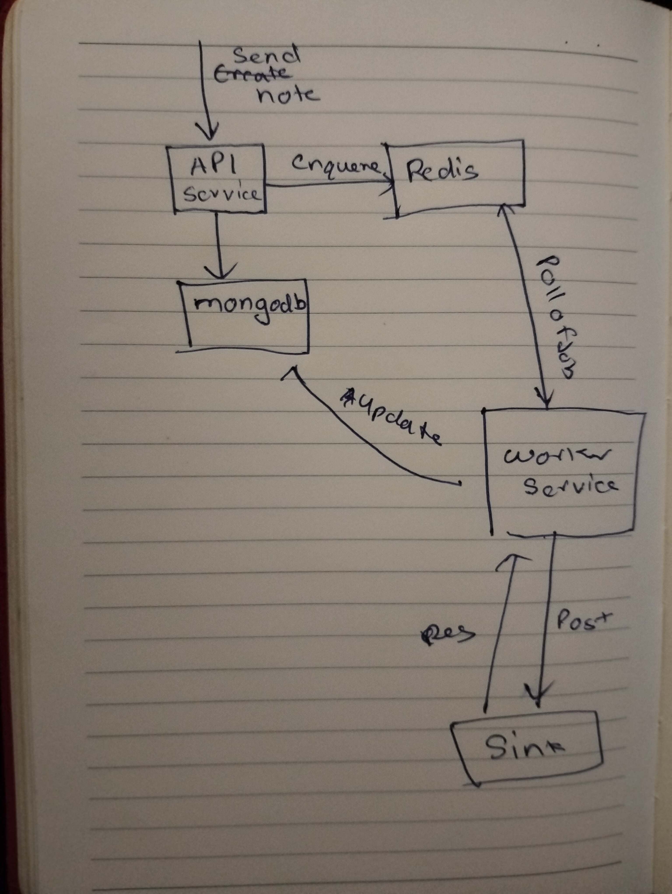

# Prerequisites

Docker & Docker Compose installed

Node.js and pnpm installed (optional if using Docker only)

Internet connection for downloading images


## Starting the Project

Clone the repository:

`git clone https://github.com/ArinPrajapati/droplater`  

`cd droplater`


Start services with Docker Compose:

```docker-compose up --build```


This will start:

`MongoDB at mongodb://localhost:27017/droplater`

`Redis at redis://localhost:6379`

`API server at http://localhost:3000`

Verify all services are running:

`docker ps`


Start frontend from termial:  
`cd droplater `  
`cd admin`  
`pnpm run dev` 


Then follow video as given google drive

# Debugging

### TypeScript
    - Problem : TS error when accessing MongoDB collections
    - Solution: added and interface to define collection document properly 

Worker Issues

After a worker ran a task, it was declared "dead".

- Cause: Worker didn’t correctly track which task it attempted and lacked a proper variable for MongoDB _id.

- Solution: Added proper _id handling and task tracking in worker logic.

 Replay notes were not being sent.

- Cause: Replays were not re-added to the queue after initial processing.

- Solution: Push the note back into the queue after processing; now it works.

### Docker-Specific Issues
- Sink not found

    - Sink is located at http://sink/hook.

    - Ensure Docker service names and network aliases match in docker-compose.yml.

- Delay timing issue

    - Delay was incorrectly set to millions of years in the future.

    -   Cause: Docker container clock was out of sync with host machine, affecting BullMQ.

    - Solution: Instead of relying on container time, calculate and send the delay from the frontend and send to the backend.




